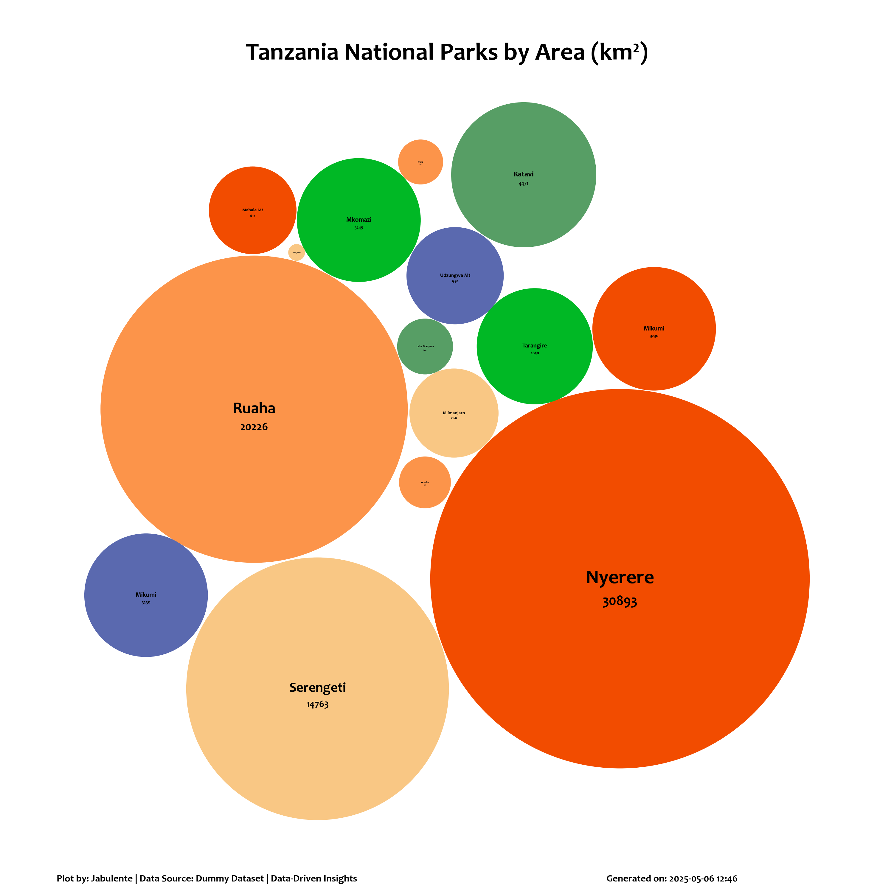

# Bubble Chart Visualization

## Overview

This project provides a Python implementation for creating visually appealing bubble charts with automatic collision detection and layout optimization. The chart is particularly useful for visualizing proportional data where both the size and position of bubbles convey meaningful information.




## Features

- **Automatic Layout**: Bubbles are automatically arranged to minimize collisions
- **Size Proportional to Data**: Bubble areas accurately represent input values
- **Customizable Appearance**: Control colors, labels, and spacing
- **Optimization Algorithm**: Intelligent bubble positioning with convergence detection
- **High-Quality Output**: Support for high-DPI image export

## Installation

### Requirements

- Python 3.7+
- NumPy
- Matplotlib
- pandas (for data handling)

### Installation

```bash
pip install numpy matplotlib pandas
```

## Usage

### Basic Usage

```python
from bubble_chart import BubbleChart, BubbleChartVisualizer
import pandas as pd

# Data for major oceans and seas with their approximate surface area in km²
data = pd.DataFrame({
    'names': ['Pacific Ocean', 'Atlantic Ocean', 'Indian Ocean', 'Southern Ocean', 'Arctic Ocean', 
              'South China Sea', 'Caribbean Sea', 'Mediterranean Sea'],
    'areas': [168723000, 85133000, 70560000, 21860000, 15558000, 3500000, 2754000, 2500000],
    'colors': ['#1f77b4', '#ff7f0e', '#2ca02c', '#d62728', '#9467bd', '#8c564b', '#e377c2', '#7f7f7f']
})


# Create visualization
visualizer = BubbleChartVisualizer()
fig = visualizer.create_bubble_chart(
    data=data,
    areas_column='areas',
    labels_column='names',
    values_column='areas',
    colors_column='colors',
    title='World Oceans and Major Seas by Surface Area'
)
plt.show()
```

### Advanced Options

```python
fig = visualizer.create_bubble_chart(
    data=data,
    areas_column='areas',
    labels_column='names',
    values_column='areas',
    colors_column='colors',
    title='World Oceans and Major Seas by Surface Area',
    figsize=(12, 12),
    bubble_spacing=0.5,
    save_path='World_Oceans_and_Seas_by_Surface_Area.png',
    dpi=300
)
```

## API Reference

### `BubbleChart` Class

#### `__init__(areas, bubble_spacing=0)`
Initialize the bubble chart with areas and optional spacing.

**Parameters:**
- `areas`: List or array of bubble areas
- `bubble_spacing`: Minimum spacing between bubbles (default: 0)

#### `collapse(n_iterations=50, convergence_threshold=0.1)`
Optimize bubble positions to minimize collisions.

**Parameters:**
- `n_iterations`: Maximum optimization iterations (default: 50)
- `convergence_threshold`: Movement threshold to reduce step size (default: 0.1)

#### `plot(ax, labels, values, colors)`
Render the bubble chart on a matplotlib axes.

**Parameters:**
- `ax`: Matplotlib axes object
- `labels`: List of bubble labels
- `values`: List of bubble values
- `colors`: List of bubble colors

### `BubbleChartVisualizer` Class

#### `create_bubble_chart(data, areas_column, labels_column, values_column, colors_column, title='', figsize=(10, 10), bubble_spacing=0.47, save_path=None, dpi=600)`
Create and optionally save a bubble chart visualization.

**Parameters:**
- `data`: DataFrame containing the visualization data
- `areas_column`: Column name for bubble areas
- `labels_column`: Column name for bubble labels
- `values_column`: Column name for bubble values
- `colors_column`: Column name for bubble colors
- `title`: Chart title (default: '')
- `figsize`: Figure size in inches (default: (10, 10))
- `bubble_spacing`: Spacing between bubbles (default: 0.47)
- `save_path`: Path to save image (default: None)
- `dpi`: DPI for saved image (default: 600)

**Returns:**
- Matplotlib Figure object

## Examples

### Example 1: Basic Bubble Chart

```python
data = pd.DataFrame({
    'categories': ['A', 'B', 'C', 'D'],
    'sizes': [30, 60, 40, 80],
    'values': [30, 60, 40, 80],
    'colors': ['red', 'blue', 'green', 'purple']
})

fig = BubbleChartVisualizer.create_bubble_chart(
    data=data,
    areas_column='sizes',
    labels_column='categories',
    values_column='values',
    colors_column='colors',
    title='Sample Bubble Chart'
)
plt.show()
```

### Example 2: Customized Visualization

```python
fig = BubbleChartVisualizer.create_bubble_chart(
    data=df,
    areas_column='population',
    labels_column='city',
    values_column='population',
    colors_column='region_color',
    title='City Population Distribution',
    figsize=(12, 8),
    bubble_spacing=0.3,
    save_path='city_population.png',
    dpi=300
)
```

## License

This project is licensed under the MIT License - see the [LICENSE](LICENSE) file for details.

## Contributing

Contributions are welcome! Please open an issue or submit a pull request for any improvements or bug fixes.

## Acknowledgments

- Inspired by various data visualization best practices
- Uses NumPy for efficient numerical computations
- Matplotlib for high-quality rendering
